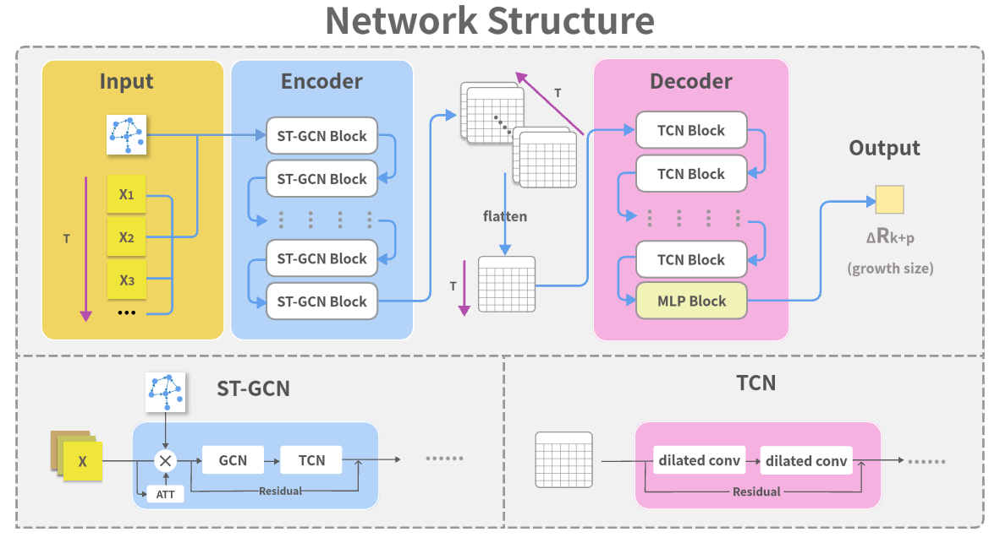

<h1 align="center">CaSTGCN: Deep Learning Method for Information Cascade Prediction </h1>

       
     

<h3> Abstract </h3>
With the maturity of social media technologies, a vast amount of information is constantly being spreaded and interacting with users on social networks. The diffusion of online information has a significant impact on individuals, organizations, and society. Thus, controlling and predicting information cascades are particularly important. Traditional information cascades prediction and pure sequence modeling methods struggle to both capture the temporal and structural information in cascades for accurate predictions. Recently, many studies have begun to explore deep learning algorithms, especially graph neural networks (GNNs) and sequence modeling neural network algorithms in predicting information cascades. Therefore, we propose a new prediction model named Deep Learning Method for Information Cascade prediction (CaSTGCN) based on an encoder-decoder structure to extract structural and temporal features of information cascades and predict their future incremental size. CaSTGCN learns the representation of cascade sequence data combined with graph data through multiple Spatio-Temporal Graphical Convolutional neural Network (ST-GCN) modules, then uses Temporal Convolutional Networks to further explore the temporal features and make predictions. Experimental results on two real-world datasets and one synthetic dataset show that our model outperforms existing models. 

    
    

        Fig. 1. The overall framework of CaST-CGN
    

<h3> Acknowledgements </h3>
Portions of this project were derived from <a href="https://github.com/MrYansong/CasSeqGCN">CasSeqGCN</a>, <a href="https://github.com/yysijie/st-gcn">ST-CGN</a> and <a href="https://github.com/locuslab/TCN">TCN</a>.